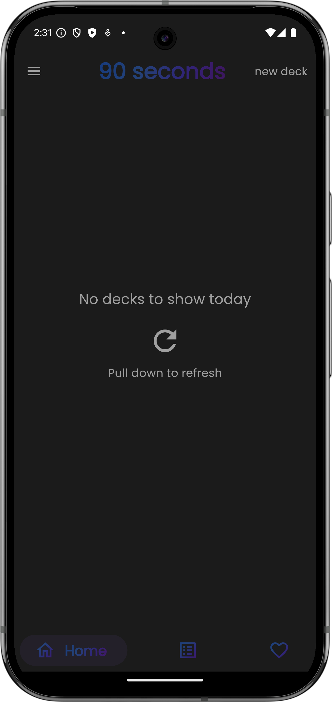
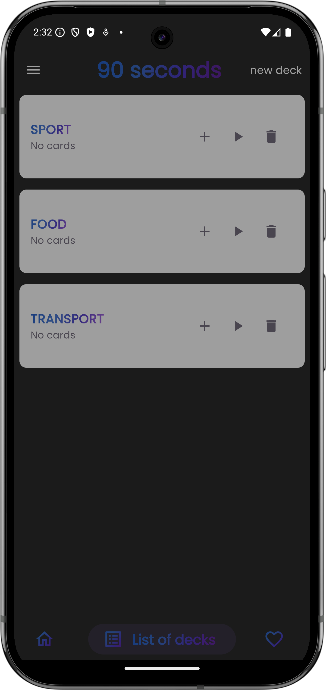
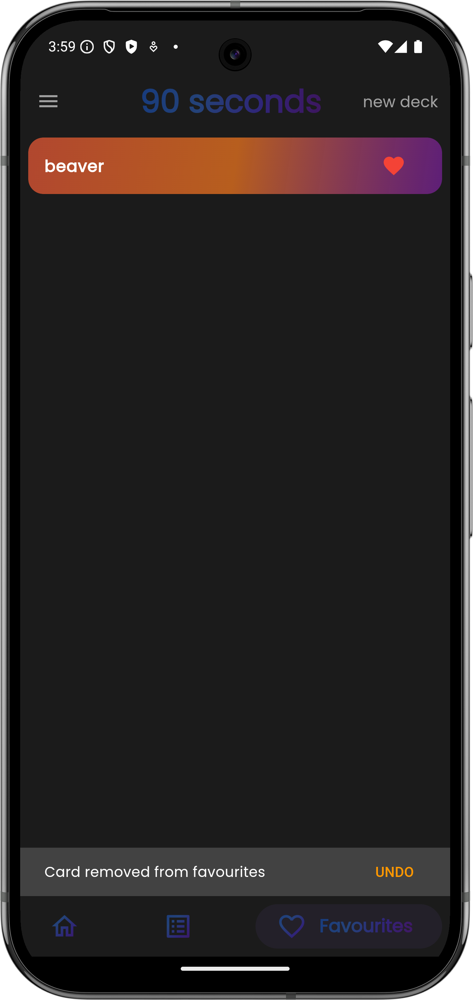
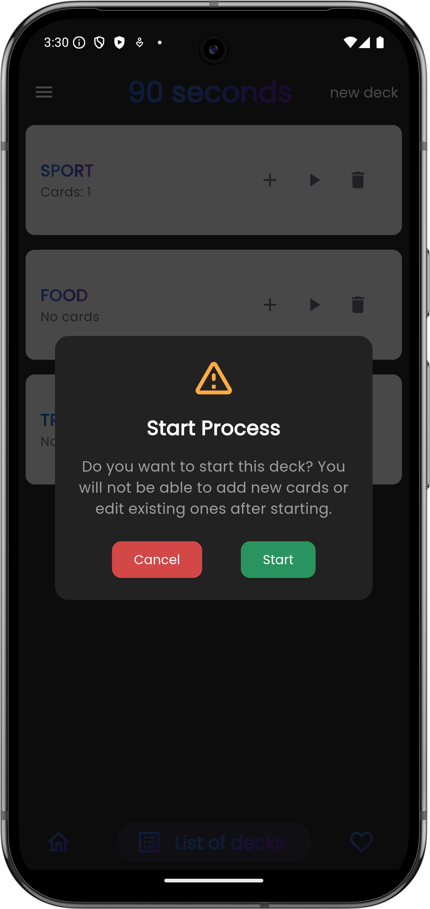
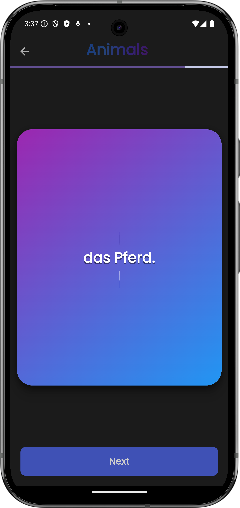
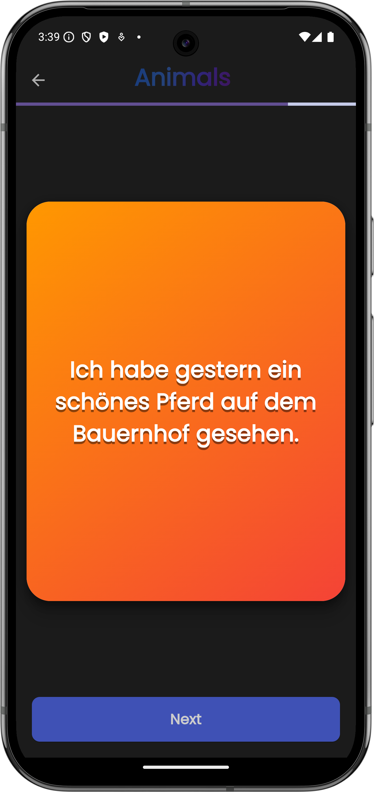

# Ninety Seconds Per Word App

A new Flutter project designed to help users learn new words efficiently.

## The strategy is as follows: 

1) When you meet a new word, you write it down in the dictionary. In context. That is, you are not writing down a “translation word”, but a whole sentence in which a word has just appeared. And the new word itself is underlined or (if you are writing an electronic document, like me, for example) it is highlighted in bold. 

2) Within seven days (conditionally from the 1st to the 7th day) you read this expression out loud once or twice. Yes, yes, only once or twice! You don't try to memorize it, but you focus on it and understand exactly what you're saying (rather than repeating it mechanically). It takes 10 seconds for two reads (verified). You do this for seven days. 

2a) Thus, if you have completed 15 new phrases in one lesson, then in the following days, spending 10 seconds on each phrase, you will spend 150 seconds repeating the material of one lesson.

3) After seven days of daily repetitions, you take a week-long break and a week later (conditionally on the 14th) read the new expression aloud three more times for 10 seconds. Yes, yes, only three times, but out loud, emotionally, clearly and concentrating on it! 

4) And two weeks later (conditionally on the 1st of the next month) you will read it aloud again three times for 10 seconds. 

Total: 90 seconds (70 + 10 + 10 ). With this strategy, the right sentence is literally “cemented” in your memory. All this has been verified by me on my own experience.

## Features

- Add new words and sentences
- Mark words as favorites
- Track learning progress
- Beautiful animations and UI

## Technologies Used

- **Flutter**: For building the cross-platform mobile application.
- **Dart**: The programming language used with Flutter.
- **Hive**: A lightweight and fast key-value database for Flutter.
- **Provider**: State management solution for Flutter.
- **Lottie**: For adding beautiful animations to the app.
- **liquid_pull_to_refresh**: For implementing pull-to-refresh functionality with beautiful liquid animations.

## Screenshots

## Resources

A few resources to get you started if this is your first Flutter project:

- [Lab: Write your first Flutter app](https://docs.flutter.dev/get-started/codelab)
- [Cookbook: Useful Flutter samples](https://docs.flutter.dev/cookbook)

For help getting started with Flutter development, view the
[online documentation](https://docs.flutter.dev/), which offers tutorials,
samples, guidance on mobile development, and a full API reference.

## License

This project is licensed under the MIT License - see the [LICENSE](LICENSE) file for details.

## Contact

For any inquiries, please contact [shaxabaxa17@gmail.com](mailto:your-email@example.com).
